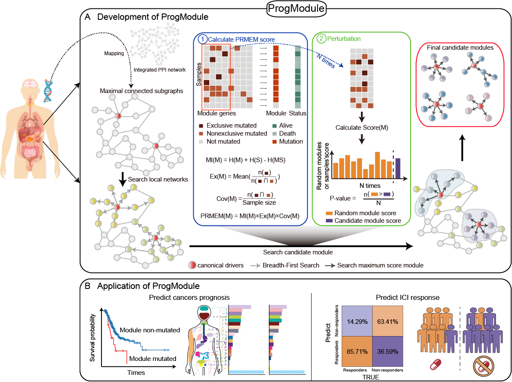

# ProgModule

[](https://github.com/Dawn-Pan/ProgModule)
[](https://www.repostatus.org/#active)
[](https://www.gnu.org/licenses/old-licenses/gpl-2.0.en.html)
[](https://app.codacy.com/gh/Dawn-Pan/ProgModule/dashboard?utm_source=gh&utm_medium=referral&utm_content=&utm_campaign=Badge_grade)
[](https://makeapullrequest.com)


ProgModule is a bioinformatics tool to identify driver modules for predicting the prognosis of cancer patients.

## Introduction

`ProgModule` is a bioinformatics tool to identify driver modules for predicting the prognosis of cancer patients, which balances the exclusive coverage of mutations and simultaneously considers the mutation combination-mediated mechanism in cancer.




## A notice on operating system compatibility

We recommended these dependencies to be installed:

- ** R (≥ 4.0.0)**: We developed this R package using R version 4.2.0.


## Installation

Install `ProgModule` using:

``` r
install.packages('devtools')
devtools::install_github("hanjunwei-lab/ProgModule")
```


## Usage

Load the package using `library(ProgModule)`. We provide a vignette for the package that can be called using: `vignette("ProgModule")`. Alternatively, you can view the online version on [CRAN](https://cran.r-project.org/web/packages/ProgModule/index.html). The examples I provided would take several minutes to run on a normal desktop computer.


